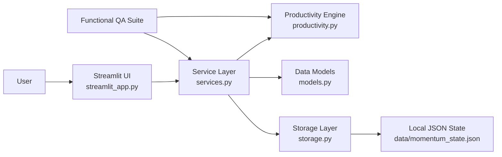
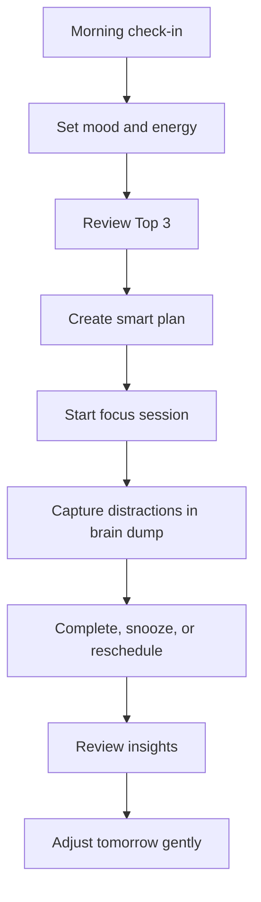

<div align="center">

# Momentum ADHD Planner

### Building calmer focus, one realistic day at a time

Momentum is a premium ADHD-friendly productivity operating system built with Streamlit. It helps users plan realistic days, protect focus, capture mental clutter, track energy, and restart without guilt.

<p>
  <a href="https://momentum-adhd-planner-miss-u.streamlit.app/"><strong>Live Streamlit App</strong></a>
  &nbsp;|&nbsp;
  <a href="https://github.com/MOHAMMED-GHANIM-SIDDIQUI/momentum-adhd-planner"><strong>GitHub Repository</strong></a>
  &nbsp;|&nbsp;
  <a href="https://github.com/MOHAMMED-GHANIM-SIDDIQUI/momentum-adhd-planner/actions/workflows/ci.yml"><strong>QA Workflow</strong></a>
</p>

<p>
  
  
  
  
  
</p>

[](https://github.com/MOHAMMED-GHANIM-SIDDIQUI/momentum-adhd-planner/actions/workflows/ci.yml)


</div>

---

## About This Repository

This repository contains the production Streamlit version of Momentum ADHD Planner, plus the original Next.js implementation kept as a design and architecture reference.

The goal is not just to store a task manager. The goal is to document and deliver a complete productivity system that supports:

- realistic daily planning
- reduced task-switching chaos
- gentle focus recovery
- lower-friction task activation
- energy and mood awareness
- guilt-free rescheduling
- calm analytics for long-term improvement

Instead of building another dense dashboard, Momentum is designed as a cognitive support system: fewer simultaneous choices, clearer next actions, and emotionally safe progress tracking.

---

## What You Will Find Here

This project includes:

- a full Streamlit productivity application
- custom premium UI styling for light and dark mode
- ADHD-first task and daily planning workflows
- smart Top 3 prioritization
- focus session tracking
- brain dump capture and conversion
- habit tracking
- energy and mood check-ins
- weekly planning and analytics
- JSON backup and import support
- tested service and productivity logic
- GitHub Actions QA automation
- original Next.js source code for reference

---

## Live Product

| Resource | Link |
| --- | --- |
| Live app | https://momentum-adhd-planner-miss-u.streamlit.app/ |
| Repository | https://github.com/MOHAMMED-GHANIM-SIDDIQUI/momentum-adhd-planner |
| CI workflow | https://github.com/MOHAMMED-GHANIM-SIDDIQUI/momentum-adhd-planner/actions/workflows/ci.yml |

---

## Product Index

Jump to a core area:

[Dashboard](#dashboard) . [Today](#today) . [Tasks](#tasks) . [Week](#week) . [Insights](#insights) . [Settings](#settings) . [Architecture](#architecture) . [Testing](#quality-assurance) . [Deployment](#deployment)

---

## What Momentum Solves

| Real user problem | Product response |
| --- | --- |
| Too many tasks create overwhelm | Daily planning protects a realistic Top 3 |
| Big tasks are hard to start | Tasks can be broken into small, actionable subtasks |
| Interrupting thoughts steal attention | Brain dump captures thoughts without switching context |
| Energy changes throughout the day | Mood and energy tracking inform planning choices |
| Focus sessions are hard to sustain | Focus mode creates a calm single-task environment |
| Unfinished work creates shame | Emergency reset and rescheduling use supportive language |
| Productivity patterns are invisible | Insights reveal completion, focus, postponement, and overload trends |

---

## Feature Index

| Area | Features |
| --- | --- |
| Planning | Daily planner, Top 3, smart plan, time blocks, overload guard |
| Tasks | Priority, category, tags, subtasks, recurrence, snooze, filters, search-ready metadata |
| Focus | Focus mode, quick focus logging, focus bank, streak support |
| Brain dump | Quick capture, mental inbox, convert to task, clear processed items |
| Habits | Daily habit toggles, streak visualization, reward points |
| Mood and energy | Daily check-in, energy slider, mood labels, planning context |
| Weekly view | Day columns, rescheduling, overload visibility |
| Insights | Plotly analytics, focus trends, completion patterns, coach-style guidance |
| Backup | Export current state, import JSON backup, local persistence |
| UI modes | Dark mode, calm mode, minimal mode, responsive layout |

---

## Application Pages

### Dashboard

The command center for starting the day gently.

- daily progress
- momentum points
- focus bank
- planned load
- Top 3 tasks
- brain dump
- habits
- overload guidance

### Today

A focused view for what is active now.

- today-only task list
- realistic load visibility
- smart plan actions
- time blocks
- emergency reset
- quick focus logging

### Tasks

The full task sanctuary.

- add and edit task details
- priority and category handling
- subtasks
- recurrence
- filters
- snooze and reschedule actions

### Week

A weekly rhythm view for spreading work before it becomes overwhelming.

- day-based planning
- visual load distribution
- quick rescheduling
- gentle weekly review

### Insights

The personal intelligence layer.

- completion trends
- focus trend chart
- energy and focus correlation
- postponement signals
- overload warnings
- coach-style recommendations

### Settings

The control room for personal capacity.

- work hours
- daily capacity
- focus duration
- break length
- backup export
- backup import

---

## Repository Structure

The codebase is separated so UI work can evolve without breaking productivity logic.

```text
momentum-adhd-planner/
|
|-- README.md
|-- streamlit_app.py
|-- requirements.txt
|-- run_tests.py
|-- QA_REPORT.md
|-- FEATURES.md
|-- SETUP_GUIDE.md
|
|-- momentum_streamlit/
|   |-- __init__.py
|   |-- models.py
|   |-- productivity.py
|   |-- services.py
|   |-- storage.py
|
|-- tests/
|   |-- test_productivity.py
|   |-- test_services.py
|
|-- .streamlit/
|   |-- config.toml
|
|-- .github/
|   |-- workflows/
|       |-- ci.yml
|
|-- data/
|   |-- .gitkeep
|
|-- src/
|   |-- app/
|   |-- components/
|   |-- lib/
|   |-- store/
|
|-- public/
    |-- icon.svg
    |-- manifest.webmanifest
    |-- sw.js
```

---

## Architecture



---

## User Flow



---

## Product Design Approach

### 1. Start with capacity

Momentum asks how much energy and time the user realistically has before encouraging more work.

### 2. Reduce visible choices

The app prioritizes Top 3 tasks, progressive disclosure, and minimal mode to avoid cognitive overload.

### 3. Support task activation

Large or vague work can be broken into smaller steps, making it easier to begin.

### 4. Protect recovery

Emergency reset, snoozing, and gentle rescheduling help users restart without shame.

### 5. Learn from patterns

Insights focus on patterns: completion, focus time, energy correlation, overload, and postponed work.

---

## Tech Stack

| Layer | Tools |
| --- | --- |
| Primary UI | Streamlit |
| Styling | Custom CSS, Streamlit theme config |
| Analytics | Plotly |
| Core language | Python |
| State model | Dataclasses |
| Persistence | Local JSON, export/import backup |
| QA | Python standard-library test runner |
| CI | GitHub Actions |
| Original frontend | Next.js 14, React, TypeScript, Tailwind CSS, Zustand, Framer Motion |

---

## Getting Started

### 1. Clone the repository

```bash
git clone https://github.com/MOHAMMED-GHANIM-SIDDIQUI/momentum-adhd-planner.git
cd momentum-adhd-planner
```

### 2. Create a Python environment

Windows:

```bash
python -m venv .venv
.venv\Scripts\activate
pip install -r requirements.txt
```

macOS or Linux:

```bash
python -m venv .venv
source .venv/bin/activate
pip install -r requirements.txt
```

### 3. Run the Streamlit app

```bash
streamlit run streamlit_app.py
```

The deploy entrypoint is:

```text
streamlit_app.py
```

---

## Quality Assurance

Momentum keeps product logic outside the UI layer so the important behavior can be tested directly.

Run the suite:

```bash
python run_tests.py
```

Current result:

```text
19/19 tests passed
```

Covered behavior includes:

- task creation and today filtering
- Top 3 limits
- smart planning
- overload detection
- recurring task generation
- micro-step generation
- emergency reset
- focus session logging
- brain dump conversion
- habit rewards
- backup export/import roundtrip

---

## Deployment

### Streamlit Community Cloud

1. Push this repository to GitHub.
2. Create a Streamlit Community Cloud app.
3. Select this repository.
4. Set the main file path to `streamlit_app.py`.
5. Deploy.

### Current live deployment

```text
https://momentum-adhd-planner-miss-u.streamlit.app/
```

---

## Data Persistence

Local app data is stored at:

```text
data/momentum_state.json
```

Streamlit Community Cloud file storage may reset between app restarts. Momentum includes JSON backup export/import so user data can be moved safely. For a long-term multi-device product, the next persistence layer should be Supabase, Firebase, or PostgreSQL.

---

## Production Readiness

- [x] Streamlit app entrypoint
- [x] Premium light and dark UI
- [x] Smooth one-click mode toggles
- [x] Hidden Streamlit visual chrome
- [x] Tested service layer
- [x] GitHub Actions workflow
- [x] Backup export/import
- [x] Plotly analytics
- [x] Responsive layout checks
- [ ] Durable cloud database
- [ ] Authentication
- [ ] Calendar integration
- [ ] Push reminders
- [ ] Speech-to-task capture

---

## Roadmap

| Phase | Upgrade |
| --- | --- |
| 1 | Streamlit deployment polish and README presentation |
| 2 | Durable cloud database and authentication |
| 3 | Calendar sync and reminders |
| 4 | AI-assisted task breakdown and scheduling |
| 5 | Multi-device productivity memory |

---

## Author

Built by [MOHAMMED-GHANIM-SIDDIQUI](https://github.com/MOHAMMED-GHANIM-SIDDIQUI).

This project represents a full product build: UX strategy, UI polish, productivity logic, testing, deployment readiness, and documentation.

---

## Closing Note

Momentum is built around one belief: progress should feel possible. The app is designed to help users choose less, start smaller, recover faster, and keep going without turning productivity into pressure.
