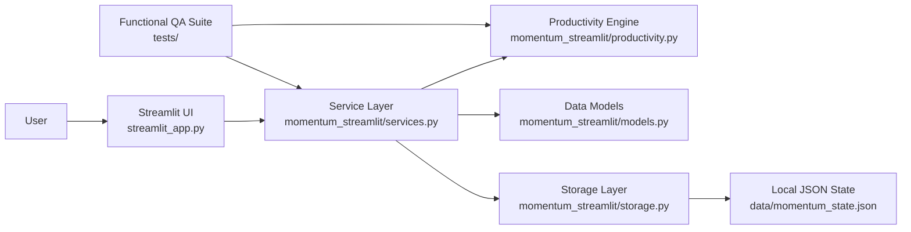
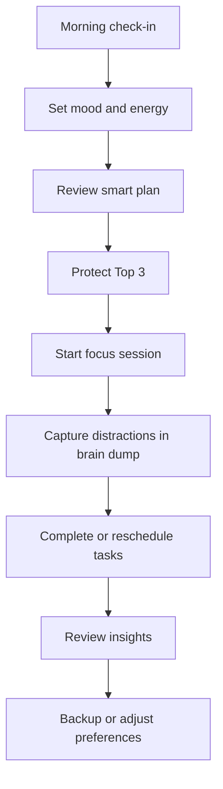

<div align="center">

# Momentum ADHD Planner

**A premium emotional productivity operating system for ADHD-friendly planning, focus, and recovery.**

Momentum helps people build realistic daily momentum without turning unfinished work into guilt. It combines smart task planning, focus sessions, mental capture, habits, energy tracking, and calm analytics in a polished Streamlit experience.

[Live Streamlit App](https://momentum-adhd-planner-miss-u.streamlit.app/) |
[GitHub Repository](https://github.com/MOHAMMED-GHANIM-SIDDIQUI/momentum-adhd-planner)

[](https://github.com/MOHAMMED-GHANIM-SIDDIQUI/momentum-adhd-planner/actions/workflows/ci.yml)


</div>

---

## Product Vision

Most productivity apps reward volume: more tasks, more widgets, more reminders, more pressure. Momentum is designed around a different principle: productive days should be realistic, emotionally safe, and easy to restart.

The app is built for people with ADHD tendencies who need support with prioritization, task activation, focus recovery, and planning without overwhelm. It acts less like a traditional dashboard and more like a calm operating system for the day.

## What Momentum Solves

| Problem | Momentum Response |
| --- | --- |
| Too many tasks competing for attention | Protects a realistic Top 3 and makes only today feel active |
| Large tasks feel hard to start | Breaks work into lower-friction micro-steps |
| Chaotic days spiral quickly | Provides emergency reset and smart rescheduling |
| Mood and energy affect execution | Tracks energy patterns and adjusts planning guidance |
| Context switching breaks focus | Offers brain dump capture and dedicated focus sessions |
| Unfinished work creates guilt | Uses gentle language, recovery states, and consistency-first rewards |

## Core Capabilities

| Area | Included Functionality |
| --- | --- |
| Daily Planning | Today view, Top 3 protection, smart load planning, time blocks, emergency reset |
| Task Management | Priorities, categories, tags, subtasks, recurrence, snoozing, search, filters, completion flow |
| Focus System | Pomodoro-style focus logging, focus minutes, streak tracking, calm focus mode |
| Brain Dump | Mental inbox, quick capture, convert-to-task workflow, processed item tracking |
| Habits | Daily habit toggles, streak support, reward points, lightweight habit reinforcement |
| Energy and Mood | Daily check-ins, mood context, energy-aware suggestions |
| Weekly Planning | Week-level scheduling surface, day grouping, load awareness, quick rescheduling |
| Insights | Completion analytics, focus trends, postponement patterns, overload detection |
| Backup | JSON export/import roundtrip for local portability |
| Personalization | Preferences for capacity, focus length, break length, theme, calm mode, minimal mode |

## Product Experience

Momentum is intentionally designed to feel calm, supportive, and premium:

- Glassmorphism-inspired Streamlit UI with custom CSS
- Dark mode, calm mode, minimal mode, and focus mode
- Custom metric cards instead of default Streamlit metrics
- Plotly-powered analytics instead of default charts
- Emotional hero sections and empty states
- ADHD-first progressive disclosure to reduce cognitive load
- Gentle coach-style insight panels and overload warnings

## Architecture



## User Workflow



## Repository Structure

```text
momentum/
  streamlit_app.py
  momentum_streamlit/
    __init__.py
    models.py
    productivity.py
    services.py
    storage.py
  tests/
    test_productivity.py
    test_services.py
  data/
    .gitkeep
  .streamlit/
    config.toml
  .github/
    workflows/
      ci.yml
  src/
    app/
    components/
    lib/
    store/
  public/
    manifest.webmanifest
    sw.js
  run_tests.py
  requirements.txt
  QA_REPORT.md
  FEATURES.md
  SETUP_GUIDE.md
  package.json
```

## Getting Started

### 1. Clone the Repository

```bash
git clone https://github.com/MOHAMMED-GHANIM-SIDDIQUI/momentum-adhd-planner.git
cd momentum-adhd-planner
```

### 2. Create a Python Environment

```bash
python -m venv .venv
.venv\Scripts\activate
pip install -r requirements.txt
```

For macOS or Linux:

```bash
python -m venv .venv
source .venv/bin/activate
pip install -r requirements.txt
```

### 3. Run the Streamlit App

```bash
streamlit run streamlit_app.py
```

Streamlit will open the app locally in the browser. The primary deployment entrypoint is:

```text
streamlit_app.py
```

## Quality Assurance

The core product logic is tested outside the UI layer so planning behavior remains reliable even as the interface evolves.

```bash
python run_tests.py
```

Current QA coverage includes:

- Task creation, completion, and filtering
- Top 3 limits and smart planning
- Micro-task breakdown
- Recurring task generation
- Brain dump conversion
- Habit rewards
- Focus logging
- Time blocking
- Emergency reset
- Overload detection
- Coach suggestions
- Backup export/import roundtrip

Current result:

```text
19/19 tests passed
```

## Deployment

### Streamlit Community Cloud

1. Push the repository to GitHub.
2. Open Streamlit Community Cloud.
3. Create a new app from this repository.
4. Set the main file path to `streamlit_app.py`.
5. Deploy.

### Data Persistence Note

When run locally, Momentum stores state in:

```text
data/momentum_state.json
```

On Streamlit Community Cloud, local file persistence can reset when the app restarts. Momentum includes JSON backup export/import for portability. For production multi-device sync, add Supabase, Firebase, or PostgreSQL behind the existing service layer.

## Original Next.js Interface

The repository also contains the original Next.js implementation. It remains useful as a frontend reference and design archive.

```bash
npm install
npm run dev
npm run build
```

The current recommended delivery target is the Streamlit implementation.

## Tech Stack

| Layer | Tools |
| --- | --- |
| Product UI | Streamlit, custom CSS, Plotly |
| App Logic | Python, dataclasses, service modules |
| Storage | Local JSON with import/export backup |
| QA | Standard-library Python test runner |
| Original Frontend | Next.js 14, React, TypeScript, Tailwind CSS, Zustand, Framer Motion |
| Deployment | GitHub, GitHub Actions, Streamlit Community Cloud |

## Production Readiness Checklist

- [x] Streamlit entrypoint ready for deployment
- [x] Business logic separated from UI
- [x] Functional QA suite included
- [x] GitHub Actions workflow configured
- [x] Backup export/import available
- [x] Dark mode and calm UI modes included
- [x] Plotly analytics used for insights
- [ ] Add durable cloud database for multi-device sync
- [ ] Add hosted authentication for multi-user deployment
- [ ] Add microphone transcription for true voice-to-task capture
- [ ] Add calendar API integration for external scheduling

## Roadmap

| Phase | Planned Upgrade |
| --- | --- |
| Phase 1 | Streamlit Cloud deployment and public demo polish |
| Phase 2 | Supabase or PostgreSQL persistence |
| Phase 3 | Authentication and multi-device sync |
| Phase 4 | Calendar integration and push reminders |
| Phase 5 | AI-assisted task breakdown and schedule recommendations |

## Author

Built by [MOHAMMED-GHANIM-SIDDIQUI](https://github.com/MOHAMMED-GHANIM-SIDDIQUI) as a modern ADHD-friendly productivity system.

## Acknowledgement

Momentum is designed around a simple belief: consistency should feel possible. The best productivity system is not the one that demands perfect days, but the one that helps you restart gently and keep going.
